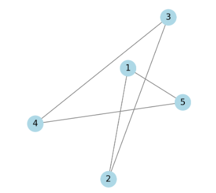
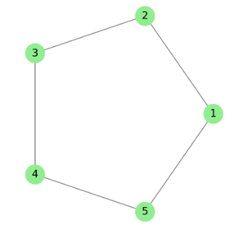

# guide to help you install and use the graph-layouts SDK

## Installation
This is an internal SDK and can be installed using pip. Run the following command in your terminal or command prompt:
```commandline
pip install graph-layouts
```

## Usage

### 1. Importing and Creating a GraphLayouts Object

After installing the SDK, import it in your Python script and create a GraphLayouts object:
```python
from graph_layouts import GraphLayouts

# Initialize the GraphLayouts object
layout_generator = GraphLayouts()
```

### 2. Creating Nodes and Edges Objects
We import Nodes and Edges schema and create corresponding objects to be passed to the fetch_layout function.

Nodes object requires a mandatory id string field and accepts additional key-value properties.<br> Edges object requires mandatory source and target fields and also accepts additional fields.
```python
from graph_layouts.constants import Nodes, Edges
nodes = [
    {"id": 1},
    {"id": 2},
    {"id": 3},
    {"id": 4},
    {"id": 5},
]
edges = [
    {"source": 1, "target": 2},
    {"source": 2, "target": 3},
    {"source": 3, "target": 4},
    {"source": 4, "target": 5},
    {"source": 5, "target": 1},
]

# Convert dictionaries to Nodes and Edges objects
nodes = [Nodes(**node) for node in nodes]
edges = [Edges(**edge) for edge in edges]
```

### 3. Generating a Layout

Call the fetch_layout() function to generate the layout:
```python
layout_name = "kamada_kawai_layout"

# Generate the layout
nodes, edges = layout_generator.fetch_layout(
    layout_name=layout_name,
    nodes=nodes,
    edges=edges
)
print(nodes, edges)


# Print or use the positions in each node
```


### 4. Output format:
```commandline

nodes=[
    Nodes(id='1', positions=Position(x=-1.0, y=0.0)),
    Nodes(id='2', positions=Position(x=-0.5, y=0.866)),
    Nodes(id='3', positions=Position(x=0.5, y=0.866)),
    Nodes(id='4', positions=Position(x=1.0, y=0.0)),
    Nodes(id='5', positions=Position(x=0.5, y=-0.866))
]
edges=[
    Edges(source='1', target='2'),
    Edges(source='2', target='3'),
    Edges(source='3', target='4'),
    Edges(source='4', target='5'),
    Edges(source='5', target='1')
]
```


